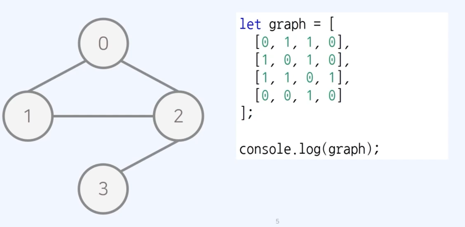
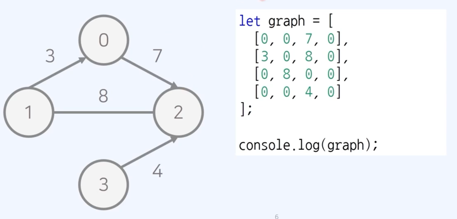
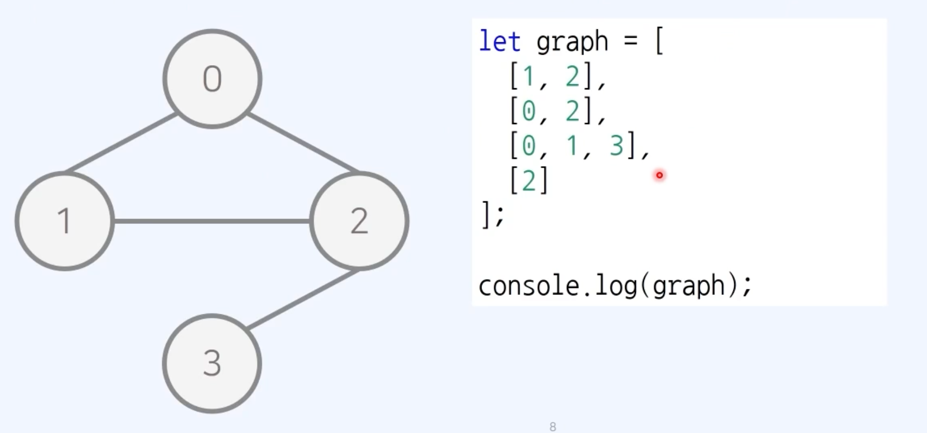
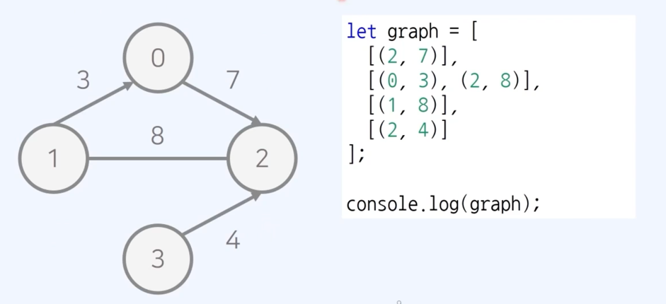

# 그래프

- 정점(vertex) 와 간선(edge) 로 나타내기 위한 도구
- 그래프는 두 가지 방식으로 구현할 수 있다.
    1. 인접 행렬 : 2차원 배열
    2. 인접 리스트 : 연결 리스트를 이용하는 방식

## (1) 인접 행렬

- 그래프를 2차원 배열로 표현한다.
1. 무방향 무가중치 그래프
    1. 모든 간선이 방향성을 가지지 않는 무방향 그래프
    2. 모든 간선에 가중치가 없는 무가중치 그래프
  

2. 방향 가중치 그래프
   1. 모든 간선이 방향을 갖는 방향 그래프
   2. 모든 간선에 가중치가 있는 가중치 그래프
   

## (2) 인접 리스트
- 그래프를 리스트로 표현
  - 각 노드마다 자기가 연결된 노드를 리스트로 표현하는 방식

1. 무방향 무가중치 그래프
  
- 여기서는 인접 행렬과는 다르게 숫자가 노드를 가리킨다.

2. 방향 가중치 그래프
  

## 그래프의 시간 복잡도
1. 인접 행렬
- 모든 정점들의 연결 여부를 저장해서 O(V^2)의 공간을 요구한다.
- 공간 효율성은 떨어지지만 두 노드의 연결 여부를 O(1) 로 확인 가능하다

2. 인접 리스트 
- 연결된 간선의 정보만을 저장하므로 O(V + E)의 공간을 요구한다
- 공간 효율성은 우수하나 두 노드의 연결 여부를 확인하려면 O(V) 만큼 걸린다.

## 인접 행렬 VS 인접 리스트
- 최단 경로 알고리즘을 구현할 때는 인접 리스트가 유리
  - 각각 근처읜 ㅗ드와 연결된 경우가 많으므로 간선 개수가 적기에 인접 리스트가 유리